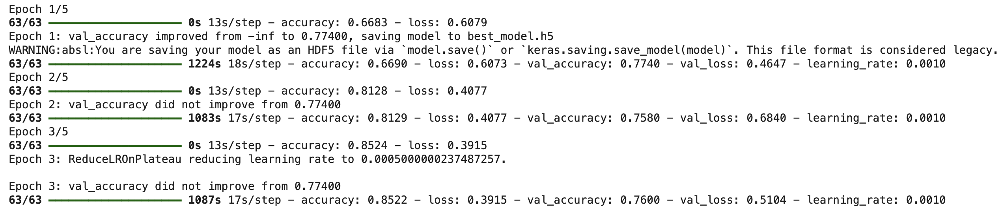
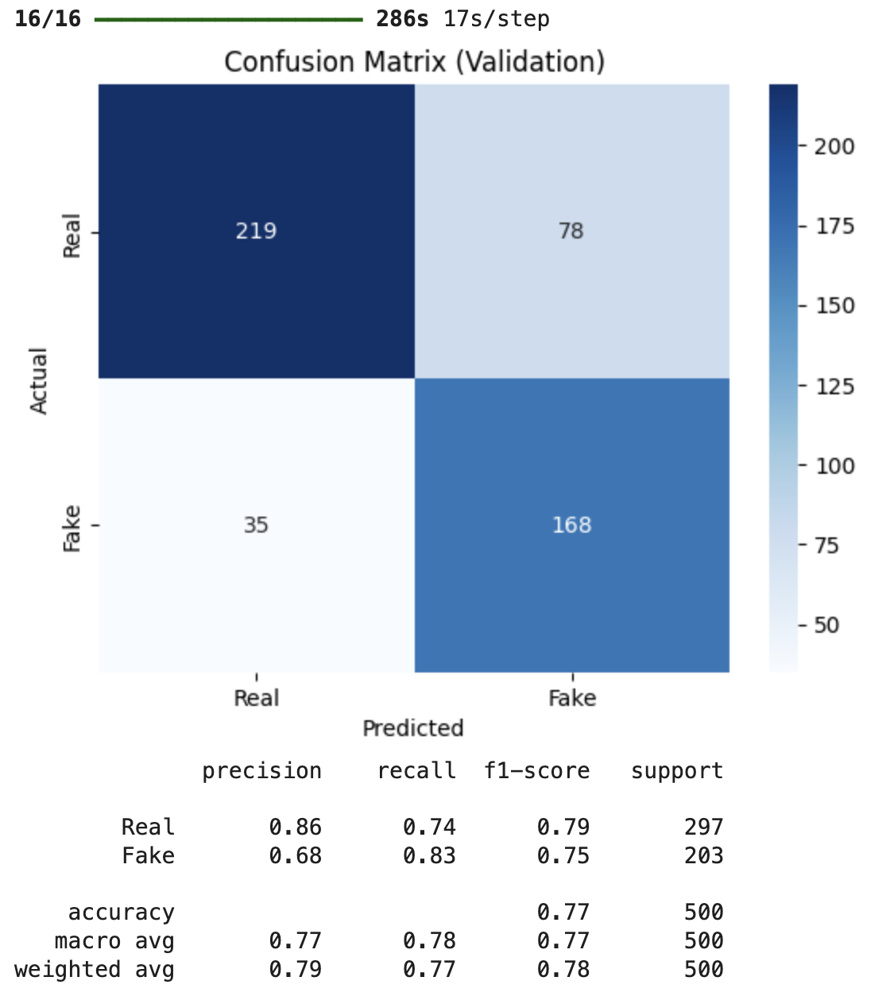
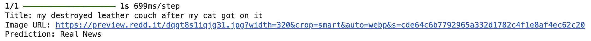
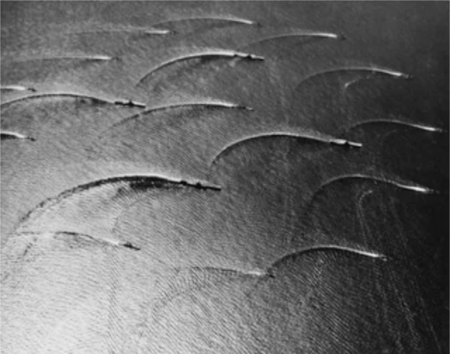

#  Multi-Modal Fake News Detector (BERT + EfficientNet)

##  Overview
This project aims to detect fake news using a multi-modal approach combining:
-  **Text (news titles)** processed via **BERT**
-  **Images** processed via **EfficientNet**

The extracted features are fused and passed through a classifier to predict whether the news is **real or fake**.

---

##  Dataset: [Fakeddit (Kaggle)](https://www.kaggle.com/datasets/vanshikavmittal/fakeddit-dataset)

- `clean_title`: Text content of the news
- `image_url`: Associated image
- `2_way_label`: Ground truth (0 = Fake, 1 = Real)

### Data Files
- `multimodal_train.tsv`
- `multimodal_validate.tsv`
- `multimodal_test_public.tsv`

---

##  Model Features

-  `TFBertModel` from HuggingFace (fine-tuned)
-  `EfficientNetB0` from Keras Applications
-  Late Fusion of BERT and CNN outputs
-  Optimizations:
  - `EarlyStopping`
  - `ReduceLROnPlateau`
  - `ModelCheckpoint`
  - Image Augmentation (`ImageDataGenerator`)
  - `tf.data.Dataset` pipeline

---

##  Architecture

```text
              ┌──────────────┐        ┌────────────────––┐
              │  Clean Text  │        │    Image URL     │
              └─────┬────────┘        └───────┬──────────┘
                    │                         │
        ┌───────────▼──────────┐   ┌──────────▼────────────┐
        │   BERT Tokenizer     │   │  Download + Resize    │
        └───────────┬──────────┘   │  (224x224, RGB)       │
                    │              └──────────┬────────────┘
            ┌───────▼────────┐      ┌─────────▼──────────┐
            │  TFBertModel   │      │  EfficientNetB0    │
            │ (CLS output)   │      │ (GlobalAvgPool)    │
            └───────┬────────┘      └─────────┬──────────┘
                    │                         │
                 ┌──▼─────────────────────────▼──┐
                 │     Concatenate (2048-D)      │
                 └──────────┬──────────────┬─────┘
                            │              │
                    ┌───────▼──────┐  ┌────▼──────┐
                    │ Dense (512)  │  │ Dropout   │
                    └───────┬──────┘  └────┬──────┘
                            └──────────┬───┘
                                       ▼
                               Dense (1, sigmoid)
                                       │
                            ┌──────────▼─────────┐
                            │   Prediction:      │
                            │    Real / Fake     │
                            └────────────────────┘
```

##  Training Summary


| Metric         | Value     |
|----------------|-----------|
| Val Accuracy   | 77.4%     |
| Val Loss       | 46.47%       |
| Train Accuracy | 90.2%     |
| Test Accuracy  | ~71.9%    |

---

## Classification Report 



| Class | Precision | Recall | F1-Score | Support |
|-------|-----------|--------|----------|---------|
| Real  | 0.86      | 0.74   | 0.79     | 297     |
| Fake  | 0.68      | 0.83   | 0.75     | 203     |

|  |  |  |  |  |
|-------|-----------|--------|----------|---------|
| **Accuracy**      |        |          | **0.77** | **500** |
| **Macro Avg**     | 0.77   | 0.78   | 0.77     | 500     |
| **Weighted Avg**  | 0.79   | 0.77   | 0.78     | 500     |


---

##  Training Details

- **Optimizer**: `Adam`
- **Loss Function**: `BinaryCrossentropy`
- **Epochs**: `5`
- **Batch Size**: `16`
- **Learning Rate Scheduler**: `ReduceLROnPlateau`
- **Checkpoints**: Best model saved as `best_model.h5`

## Test Prediction




